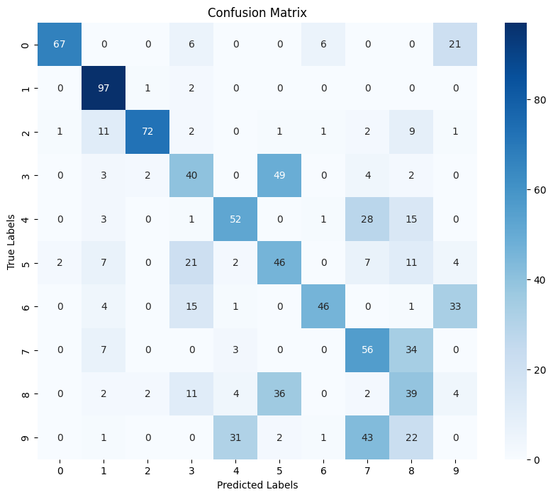

# k-means-clustering-mnist

# Hypothesis
Since K-means clustering is unsupervised, we don't use label information during training. This means it cannot inherently improve based on digit-specific characteristics. Thus, we expect clusters to be messy, as some digits that look similar will get mixed up. K-means clustering on raw MNIST data is not expected to achieve the best performance.

## Result

We see that the model classifies smaller digits (0, 1, or 2) better compared to higher digits (7, 8, or 9). The model struggles with similar digit structures like 4 and 9.

Based on the figure above, I calculated **purity**, which can be an accuracy measurement in K-means clustering. The purity of K-means clustering was **0.5670**. This means that, on average, **56.7%** of images in each cluster belong to the same class. A **56.7% purity** indicates that K-means forms mixed clusters, leading to misclassification. This result aligns with our hypothesis that K-means clustering on MNIST data is not expected to achieve the best performance.

## What is the Accuracy of the Clustering?
In unsupervised learning, clustering accuracy is measured using **purity**. Purity quantifies how homogeneous the clusters are concerning the true labels. Higher purity indicates better clustering accuracy.

## Comparison of Purity and Accuracy

### Numerical Comparison
- **FCNN Accuracy:** **83%**  
- **K-means Purity:** **56.7%**  

Comparing the **accuracy** of FCNN and the **purity** of K-means clustering is tricky because they measure different things:
- **Accuracy (FCNN)** measures how well a model classifies each sample into the correct class. It learns from labeled data and optimizes classification. Since it has access to true labels, it can improve accuracy during training.
- **Purity (K-means)** measures how well clustering aligns with true labels. Since K-means is **unsupervised**, it groups data points based on similarity **without knowing the true labels**. It only approximates class separation, leading to lower purity.

In general:
- **83% accuracy** is considered good but not extremely high.
- **Purity below 50%** indicates poor clustering, close to random.  
- **56.7% purity** means, on average, the largest class in each cluster makes up **56.7%** of the data in the cluster.

### Summary
- **Accuracy** evaluates correct classifications.
- **Purity** measures cluster homogeneity.
- **Supervised models (FCNN)** optimize classification accuracy.
- **Unsupervised models (K-means)** do not use label information, so their clusters are often less structured.

## Conclusion
- **Purity and accuracy are related but not identical.**
- **FCNN achieves higher accuracy because it is supervised.**
- **K-means clustering has lower purity due to the lack of label guidance.**

## Challenges
K-means clustering does not inherently associate clusters with class labels. That is, **cluster label 0 does not necessarily correspond to class label 0**. To evaluate clustering performance, we must **align the cluster labels with the true labels**, requiring **the best mapping between cluster assignments and ground truth labels**.

Initially, I did not realize this mapping step was needed, leading to confusion about the poor clustering results. To resolve this, I used the **Hungarian algorithm**, which optimally assigns data points to clusters based on distances. After applying the Hungarian algorithm, I could meaningfully evaluate **purity** as a metric of cluster quality.
